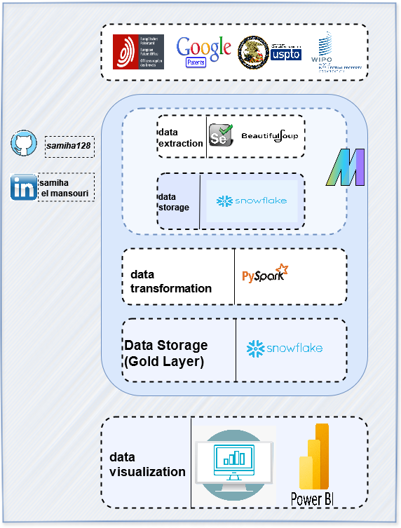

# Patent-Analysis

## Table of Contents 📋
- [Overview](#overview)
- [Installation](#installation)
- [Usage](#usage)
- [Difficulties](#difficulties)
- [Points to Improve](#points-to-improve)
- [Tools](#tools)
- [Architecture](#architecture)
- [Dashboard](#dashboard)
- [Contact](#contact)

## 🚀 Overview
This project focuses on analyzing patents in the domain of **aviation fuel** using **Snowflake** as the data warehouse. The analysis aims to extract insights from patent data, facilitating better understanding and innovation in the aviation fuel industry.

Key features include:
1. **Data orchestration** using **Mage** to manage and schedule data workflows.
2. **Star schema** design in Snowflake for efficient querying and data analysis.
3. **Web interface** developed with **JavaScript/HTML/CSS** for user interaction and data input.
4. **Data visualization** and analysis using **Power BI** to present findings effectively.

## 🛠️ Installation
To set up and run this project locally, follow these steps:

1. Clone the repository:
    ```bash
    git clone https://github.com/Samiha128/Patent-Analysis
    ```
2. Navigate to the project directory:
    ```bash
    cd patent-analysis
    ```


3. Set up your Snowflake account and configure the connection:
    Create a `config.yml` file and include your Snowflake credentials:
    ```yaml
    snowflake:
      account: your-account
      user: your-username
      password: your-password
      warehouse: your-warehouse
      database: your-database
      schema: your-schema
    ```

4. Set up and run MAGE for orchestration:
    

5. Run your web application:
   

## 🚀 Usage
This project includes a web interface for users to interact with patent data and view analysis results.

### Steps to use the project:

1. **Input patent data** through the web interface.
2. **Run Mage** to orchestrate data processing and loading into Snowflake.
3. **Query and analyze** the data in Snowflake using SQL.
4. **Visualize results** in Power BI by connecting it to your Snowflake database.

## 🛠️ Difficulties
- Managing the orchestration of complex data workflows in Mage.
- Ensuring efficient data loading and querying in Snowflake.
- Handling large volumes of patent data for analysis.
- Designing an intuitive web interface for user interaction.
- Integrating Power BI with Snowflake for seamless data visualization.

## 🔧 Points to Improve
- Enhance the web interface for better user experience and accessibility.
- Implement more advanced analytics features in Power BI for deeper insights.

## 🛠 Tools
- **Mage**: For data orchestration and workflow management.
- **Snowflake**: As the data warehouse with a star schema design.
- **JavaScript/HTML/CSS**: For developing the web interface.
- **Power BI**: For data visualization and reporting.
- **Git**: For version control.

## 🏗 Architecture




## 📊 Dashboard
Once the data is processed, it can be visualized using Power BI, including:
- Trends in patent filings in aviation fuel.
- Analysis of innovations and technologies in the industry.

## 📞 Contact
For any questions or issues, feel free to reach out:
-[](https://www.linkedin.com/in/samiha-el-mansouri-27505b250/)
